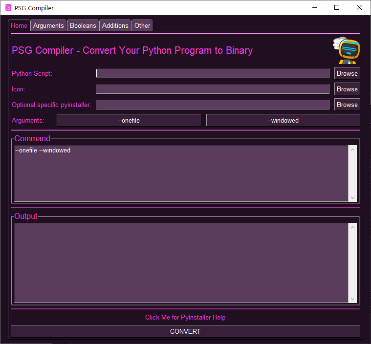

<p align="center">
  <p align="center"><p>

  <h2 align="center">psgcompiler</h2>
  <h2 align="center">A PySimpleGUI Application</h2>
</p>

PySimpleGUI "Compiler"

"Compile" your Python programs into a Windows EXE, a Mac APP, and a Linux binary!

Adds a user-friendly GUI to the popular PyInstaller python package

<p align="center"><p>


## Features

* Creates single file distribution files for Windows, Mac, and Linux
* PySimpleGUI front end for PyInstaller
* All the capabilities of PyInstaller with the ease of a GUI


## Installation

### Using PIP with PyPI

The latest official release of PySimpleGUI products can be found on PyPI.  To pip install the demo applications from PyPI, use this command

#### If you use the command `python` on your computer to invoke Python (Windows):

`python -m pip install --upgrade psgcompiler`

#### If you use the command `python3` on your computer to invoke Python (Linux, Mac):

`python3 -m pip install --upgrade psgcompiler`

### Using PIP with GitHub

You can also pip install the PySimpleGUI Applications that are in the PySimpleGUI GitHub account.  The GitHub versions have bug fixes and new programs/features that have not yet been released to PyPI. To directly pip install from that repo:

#### If you use the command `python` on your computer to invoke Python (Windows):

```bash
python -m pip install --upgrade https://github.com/PySimpleGUI/psgcompiler/zipball/main
```

#### If you use the command `python3` on your computer to invoke Python (Linux, Mac):

```bash
python3 -m pip install --upgrade https://github.com/PySimpleGUI/psgcompiler/zipball/main
```


## Usage

Once installed, launch psgcompiler by typing the following in your command line:

`psgcompiler`

## `PyInstaller` Back-end with a `PySimpleGUI` Front-end

The plan for `psgcompiler` is to provide a GUI interface for a number of the tools available to convert a Python program into a binary executable.  PyInstaller was chosen as the first back-end tool that does the heavy-lifting of converting your code into a binary executable.  The next one being added is `cx_freeze`.

`psgcompiler` collects the options that are assembled into the command that can then be run for you by launching a subprocess.  You will see the command being built as you add or remove items using the GUI.  You can run PyInstaller manually using the options shown in the "Command" box.  Type `pyinstaller` on the command line and paste the text you see under "Command" in the Home tab of the psgcompiler program. 


PyInstaller transforms your Python project into an executable that you can distribute to friends, family members, colleagues, the public, other developers, ...  Anyone that does not have Python installed on their machine will be able to run your program after you've turned it into a binary executable.

PySimpleGUI users in particular will greatly benefit from `psgcompiler` as you'll be able to distribute "Windows Programs".  Most likely no one will know you're using Python.  On Windows, you can create a single EXE file. One-file is the default setting.  After converting, you'll be left with a single EXE file.

## A Multitude Of Options

`PyInstaller` has a sh*t-ton of options!  Unlike the primitive EXE Maker that the PySimpleGUI project created, the `psgcompiler` exposes all of the options in an easy to use way.

## Simple Interface, Complex Settings

While `psgcompiler` makes it easy to specify the many options available for PyInstaller, it doesn't remove the complexity that comes with using PyInstaller.

Please refer to the **[PyInstaller documentation](https://pyinstaller.readthedocs.io/en/stable/)** to better understand the available options.  It can be tricky to convert some programs, particularly if you're using other Python packages in addition to PySimpleGUI.

## All Python Programs Welcomed...

Your Python program doesn't have to use PySimpleGUI in order to use the `psgcompiler` tool.  PySimpleGUI is being used to give you a GUI front-end to PyInstaller.  There is no requirement that your program use PySimpleGUI.


## Troubleshooting PyInstaller Problems

When it comes to PyInstaller use, I'm a user of PyInstaller, just as you are.  The PySimpleGUI project isn't populated with PyInstaller experts.  You'll need to use your programming prowess to find answers to problems you may encounter using PyInstaller.

We're making it easy for you to run PyInstaller, and soon additional similar utilities, but that doesn't mean it's going to be easy overall.

The PyInstaller documentation is well-written and can be found here:  
https://pyinstaller.readthedocs.io/en/stable/

## A Simple EXE

If your program is relatively simple, then you only need to supply the name of your Python file, and an optional icon file.

Here is an example session showing only the .pyw file and the .ico file being supplied.  


<p align="center"><p align="center"><p><p>


## Additional Back-ends

Currently in the works is support for additional back-ends.  `cx_freeze` is up next.

## Create a Shortcut To This Program

If you're a Windows user, then use the [`psgshortcut` application](https://pypi.org/project/psgshortcut/) to make a shortcut to this program so that you can then put on your desktop or pin to your taskbar (or any  other use that stops the need to type `psgcompiler` ever again).

## License & Copyright

Copyright 2023-2024 PySimpleSoft, Inc. and/or its licensors.

This is a free-to-use "Utility" and is licensed under the
PySimpleGUI License Agreement, a copy of which is included in the
license.txt file and also available at https://pysimplegui.com/eula.

Please see Section 1.2 of the license regarding the use of this Utility,
and see https://pysimplegui.com/faq for any questions.


## Contributing

We are happy to receive issues describing bug reports and feature
requests! If your bug report relates to a security vulnerability,
please do not file a public issue, and please instead reach out to us
at issues@PySimpleGUI.com.

We do not accept (and do not wish to receive) contributions of
user-created or third-party code, including patches, pull requests, or
code snippets incorporated into submitted issues. Please do not send
us any such code! Bug reports and feature requests should not include
any source code.

If you nonetheless submit any user-created or third-party code to us,
(1) you assign to us all rights and title in or relating to the code;
and (2) to the extent any such assignment is not fully effective, you
hereby grant to us a royalty-free, perpetual, irrevocable, worldwide,
unlimited, sublicensable, transferrable license under all intellectual
property rights embodied therein or relating thereto, to exploit the
code in any manner we choose, including to incorporate the code into
PySimpleGUI and to redistribute it under any terms at our discretion.
